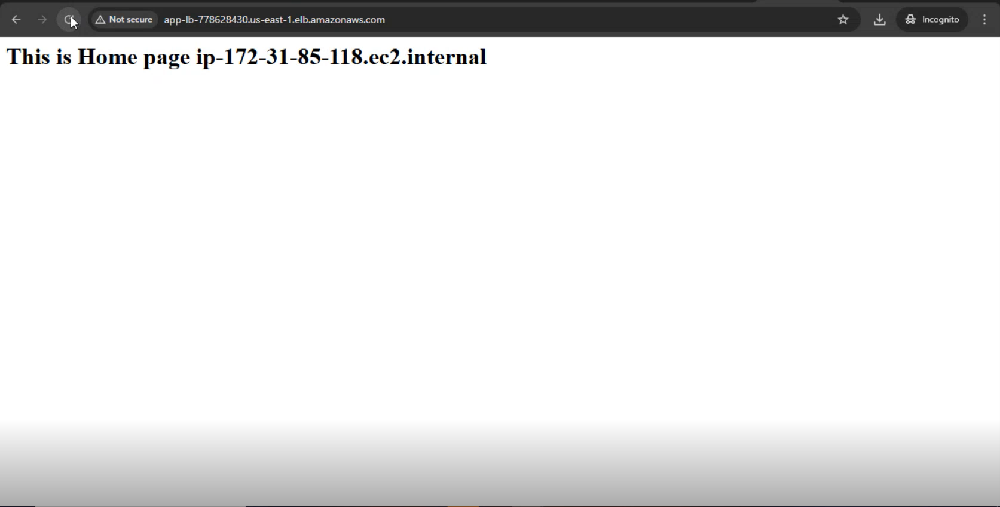

# Deployed Extended Application Using Application Load Balancer (ALB) with Auto Scaling

This project demonstrates how to deploy a three-part web application on AWS using Amazon EC2, Application Load Balancer (ALB), and Auto Scaling Groups (ASGs). The application serves distinct content on the Home, Mobile, and Laptop paths, each powered by its own EC2 group managed by Auto Scaling.


---

## Table of Contents

- Project Overview

- Architecture Diagram

- EC2 Launch Template Setup

- Target Groups and ALB Setup

- Auto Scaling Group Configuration

- Routing Rules

- Testing the Application

- Conclusion

---

##  Project Overview

This project simulates a website where:
- The **Home page** is hosted at `/`
- The **Mobile page** is hosted at `/mobile/`
- The **Laptop page** is hosted at `/laptop/`


#### **9 EC2 Instances via Auto Scaling:**

- 3 for Home

- 3 for Mobile

- 3 for Laptop


**Application Load Balancer (ALB)** routes to each group based on the request path.

---

---
                 ┌───────────────┐
                 │    Clients    │
                 └──────┬────────┘
                        │
                        ▼
           ┌──────────────────────────┐
           │ Application Load Balancer│
           └─────┬─────────┬──────────┘
                 │         │
        ┌────────▼─┐   ┌───▼────────┐
        │ Path: /  │   │ Path: /mobile/ │
        │ home-ASG │   │ mobile-ASG     │
        └──────────┘   └─────┬──────────┘
                             │
                       ┌─────▼───────┐
                       │ Path: /laptop/ │
                       │  laptop-ASG    │
                       └───────────────┘


## 💻 EC2 Instance Setup

Create 3 separate Launch Templates for Home, Mobile, and Laptop with the following User Data:

---

###  Home Page (2 Instances)

```bash
#!/bin/bash
sudo yum update -y
sudo yum install -y httpd
sudo systemctl start httpd
sudo systemctl enable httpd
echo "<h1>This is Home page $(hostname -f)</h1>" > /var/www/html/index.html
```


### Mobile Page (2 Instances)
```bash
#!/bin/bash
sudo yum update -y
sudo yum install -y httpd
sudo systemctl start httpd
sudo systemctl enable httpd
sudo mkdir -p /var/www/html/mobile
echo "<h1>This is Mobile page $(hostname -f)</h1>" > /var/www/html/mobile/index.html
```

### Laptop Page (2 Instances)
```bash
#!/bin/bash
sudo yum update -y
sudo yum install -y httpd
sudo systemctl start httpd
sudo systemctl enable httpd
sudo mkdir -p /var/www/html/laptop
echo "<h1>This is Laptop page $(hostname -f)</h1>" > /var/www/html/laptop/index.html
```

### Security Group
Allow inbound HTTP traffic (port 80) to all instances:

* Type: HTTP

* Protocol: TCP

* Port Range: 80

* Source: Anywhere (0.0.0.0/0)

 ### Application Load Balancer Setup
* Go to EC2 > Load Balancers and click Create Load Balancer.

* Choose Application Load Balancer.

* Set it as Internet-facing, and select HTTP on port 80.

* Assign it to appropriate subnets in your VPC.

* Create a new Security Group allowing port 80.

### Target Groups
#### Create three Target Groups of type Instance:

#### 1. Home Target Group
* Name: home-target

* Protocol: HTTP

* Port: 80

* Register: 2 Home instances

### 2. Mobile Target Group
* Name: mobile-target

* Protocol: HTTP

* Port: 80

* Register: 2 Mobile instances

### 3. Laptop Target Group
* Name: laptop-target

* Protocol: HTTP

* Port: 80

* Register: 2 Laptop instances

### Auto Scaling Group Configuration:
 Create 3 Auto Scaling Groups, each linked to its respective Launch Template and Target Group:

 **1. Home ASG**
 - Launch Template: Home Template

- Target Group: home-target

- Desired: 3 | Min: 1 | Max: 5

- Scaling policy: CPU > 70%

**2. Mobile ASG**
- Launch Template: Mobile Template

- Target Group: mobile-target

- Desired: 3 | Min: 1 | Max: 5

- Scaling policy: CPU > 70%

**3. Laptop ASG**
- Launch Template: Laptop Template

- Target Group: laptop-target

- Desired: 3 | Min: 1 | Max: 5

- Scaling policy: CPU > 70%

### Routing Rules
#### While setting up the listener:

Default Rule:

Forward to home-target

Add Rules:

Path: /mobile/* → Forward to mobile-target

Path: /laptop/* → Forward to laptop-target


### Testing the Application
After successful setup:

Copy the DNS name of the load balancer from the EC2 console.

Open browser and visit:

### Home Page:
```bash
http://<ALB-DNS-Name>
```
### Mobile Page:
```bash
http://<ALB-DNS-Name>/mobile/
```
### Laptop Page:
```bash
http://<ALB-DNS-Name>/laptop/
```
Each page should display its hostname and type (Home, Mobile, or Laptop).

## Output Example




 ## Conclusion

 This project demonstrates how to deploy a path-based routed web application using Amazon EC2, Auto Scaling Groups, and an Application Load Balancer. With automatic scaling, fault tolerance, and a clean separation of responsibilities, this architecture ensures high availability, efficient routing, and scalability for different application components


